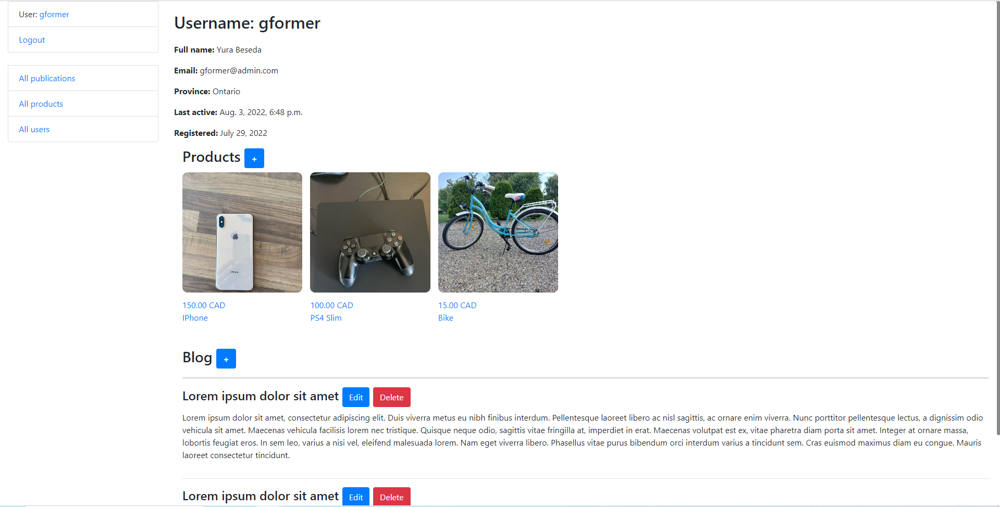

# Marketplace Project

Django project, which works the same as Facebook Marketplace

## Check it out!

[Marketplace project deployed to Heroku](https://portfolio-marketplace.herokuapp.com/)

## Installation

Python3 must be already installed

```shell
git clone https://github.com/YuraBeseda/marketplace
cd marketplace
python3 -m venv venv
source venv/bin/activate
pip install -r requirements.txt
python manage.py runserver #starts Django Server 
```

## Features

* Authentication functionality for Trader/User
* Managing products publications & traders from website interface 
* Powerful admin panel for advanced managing

## Demo


